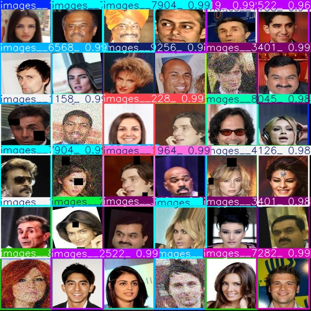

# 🎬 Celebrity Detection using YOLOv8

This project implements a **celebrity detection system** using the **YOLOv8 deep learning model**.  
It automatically identifies and localizes multiple celebrities in an image by training a custom object detection model.


## 📚 Project Overview

### Step 1 – Data Augmentation

* Used **Albumentations** to generate more diverse training images (rotations, blurs, color shifts, etc.).
* This improved model generalization and robustness.

  ```bash
  python main_augmentation.py
  ```

### Step 2 – Dataset Creation
- Individual celebrity images were concatenated to form a **grid-style dataset** for object detection.
- Each cell in the grid contains one celebrity’s face.
- The YOLOv8 dataset (images + labels) was generated using:
  ```bash
  python main_generate_dataset.py
  ```

### Step 3 – Model Training

* A YOLOv8 model was trained from the generated dataset.
* Configuration parameters such as image size, epochs, and batch size are specified in `main_train.py`.

  ```bash
  python main_train.py
  ```

**Training results summary**

```
mAP50:     0.9793
mAP50-95:  0.9784
Precision: 0.9596
Recall:    0.9397
```

### Step 4 – Multi-Celebrity Detection (Testing & Evaluation)

Given an image containing multiple celebrities, the trained YOLOv8 model detects all faces, identifies each celebrity by **ID and name**, and provides **bounding box coordinates**.

Example script:

```bash
python detect_single_image.py
```

**Sample Output**

```
Detected 36 celebrities:
------------------------------------------------------------
 1. images__10046_ (ID: 0) Conf: 0.97
 2. images__7904_ (ID: 1) Conf: 0.95
 ...

Celebrities detected in grid layout:
============================================================
Row 1, Col 1  →  images__10046_
Row 1, Col 3  →  images__7904_
Row 2, Col 1  →  images__7904_
Row 2, Col 5  →  images__619_
============================================================

Annotated image saved to: results/multiple_celebrities_detected.jpg
```

The saved image shows each detected celebrity face with bounding boxes and confidence scores.

---

## 🧩 Project Structure

```
Computer-Vision/
│
├── data/
│   ├── Celebrity_Image_Subsets/           # Raw celebrity folders
│   ├── celebrity_detection_dataset/       # YOLO dataset (images + labels)
│   └── Celebrity_Image_Subsets.zip
│
├── runs/
│   └── detect/
│       ├── celebrity_detector/            # YOLO training results
│       ├── val/                           # Validation runs
│       └── val2/
│
├── src/
│   ├── dataset/
│   │   ├── augmentation.py                # Data augmentation pipeline
│   │   └── dataset_generator.py           # Dataset creation logic
│   │
│   ├── models/
│   │   └── yolo_model.py                  # YOLO model loader
│   │
│   ├── test/
│   │   └── test.py                        # Detection + evaluation class
│   │
│   └── training/
│       └── train.py                       # Model training class
│
├── test_results/
│   ├── batch_detection/                   # Batch detection outputs
│   └── detection_result.jpg
│
├── main_augmentation.py
├── main_generate_dataset.py
├── main_train.py
├── main_test.py
├── detect_single_image.py                 # Step 4 script (final inference)
├── requirement.txt
└── README.md
```

---

## ⚙️ Setup Instructions

### 🧱 1. Clone the Repository

```bash
git clone https://github.com/pramothguhan/Computer-Vision-Based-Attendance-System---Multi-Face-Recognition.git
cd Computer-Vision-Based-Attendance-System---Multi-Face-Recognition
```

### 🧪 2. Create a Virtual Environment

You can either use **conda** or **venv**.

#### Using Conda:
```bash
conda create -n celeba python=3.10 -y
conda activate celeba
pip install -r requirements.txt
```

#### Using venv:
```bash
python -m venv celeba_env
celeba_env\Scripts\activate      # On Windows
source celeba_env/bin/activate   # On macOS/Linux
pip install -r requirements.txt
```

---

**Required core libraries:**

* ultralytics
* opencv-python
* albumentations
* numpy
* pyyaml
* tqdm
---

## ⚙️ How to Run the Project

### 2️⃣ Dataset Generation

```bash
python main_generate_dataset.py
```

### 3️⃣ Data Augmentation

```bash
python main_augmentation.py
```

### 4️⃣ Train the Model

```bash
python main_train.py
```

### 5️⃣ Test / Detect

```bash
python main_test.py
```

or run **multi-celebrity detection** on any single image:

```bash
python detect_single_image.py
```

---

## 📸 Example Output

| Input Image                                             | Detection Output                             |
| ------------------------------------------------------- | -------------------------------------------- |
|  |  |

---

## 🧠 Key Components

| File                     | Description                                                     |
| ------------------------ | --------------------------------------------------------------- |
| `augmentation.py`        | Generates augmented images for each celebrity.                  |
| `dataset_generator.py`   | Builds YOLO dataset with grid concatenation and annotations.    |
| `train.py`               | Handles YOLOv8 training process.                                |
| `test.py`                | Performs single/batch inference and evaluation.                 |
| `detect_single_image.py` | Detects multiple celebrities and maps them to grid coordinates. |

---

## 🏆 Results

| Metric        | Score  |
| ------------- | ------ |
| **mAP50**     | 0.9793 |
| **mAP50-95**  | 0.9784 |
| **Precision** | 0.9596 |
| **Recall**    | 0.9397 |

**Model:** YOLOv8-Nano (`yolov8n.pt`)  
**Training Epochs:** 60  
**Image Size:** 640×640  
**Batch Size:** 16  

---

## 🧾 References

* [Ultralytics YOLOv8 Documentation](https://docs.ultralytics.com/)
* [Albumentations Image Augmentation Library](https://albumentations.ai/)
* [OpenCV Documentation](https://docs.opencv.org/)

---

### 👨‍💻 Authors

- Pramoth Guhan
- Haritha Anand
- Keshika Arunkumar
- Rahul Odedra

Developed as part of the **Computer Vision Based Attendance System Multi-Face Recognition**  

---
